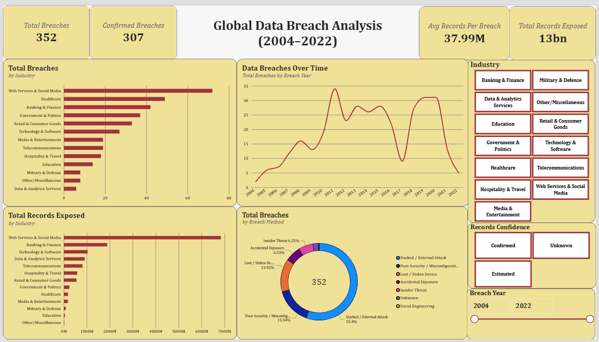
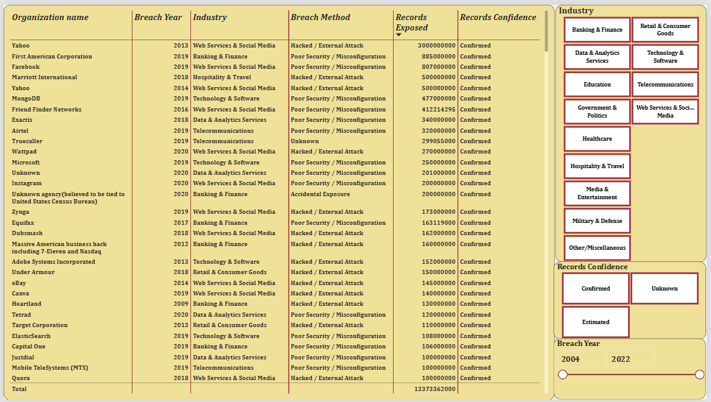

# Global Data Breach Analysis

An interactive Power BI dashboard analysing 350+ publicly reported data breaches from 2004 to 2022, exploring breach trends over time, the industries most affected, and how breaches happen.

## Overview

This project covers the full BI workflow; data cleaning, modeling, DAX measures, and dashboard design using a real-world dataset that required significant cleanup before it was analysis-ready.

Key features:
- KPI summary cards (total breaches, confirmed breaches, average records exposed, total records exposed)
- Breach trend over time (2004-2022)
- Breakdown by industry (breach count and records exposed)
- Breakdown by breach method (hacked, poor security/misconfiguration, insider threat, accidental exposure, lost/stolen device, social engineering)
- Full detail table with a data-quality flag on every row
- Interactive slicers for year, industry, and data confidence

## Data Source

Data Breaches - A Comprehensive List (Kaggle), covering real-world publicly disclosed breaches.
https://www.kaggle.com/datasets/thedevastator/data-breaches-a-comprehensive-list

## Data Cleaning (Power Query)

The raw dataset needed substantial cleaning before it could support reliable analysis:

- Records Exposed: about a third of values weren't clean numbers, for example unknown, 235 GB, tens of thousands, and 9,000,000 (approx) - basic booking, 2208 (credit card details). Rather than discarding these rows, I kept the original text, built a parsed numeric column, and added a Records Confidence flag (Confirmed / Estimated / Unknown) so the dashboard is transparent about which figures are exact vs. approximate.
- Organization Type: 70 overlapping/inconsistent category labels (e.g. web, web service, tech, web) were consolidated into 13 clear industry categories.
- Breach Method: 25 inconsistent labels (varied casing, combined values like poor security/inside job) were standardised into 7 categories.
- Year - a few entries were stored as ranges (e.g. 2019-2020) rather than a single year and were normalised.

## Tools

Power BI Desktop (Power Query, Data Modeling, DAX)

## Files

- Global Data Breach Analysis.pbix : the Power BI report file
- df_1.csv : the source dataset
- 1.png, 2.png : dashboard screenshots
